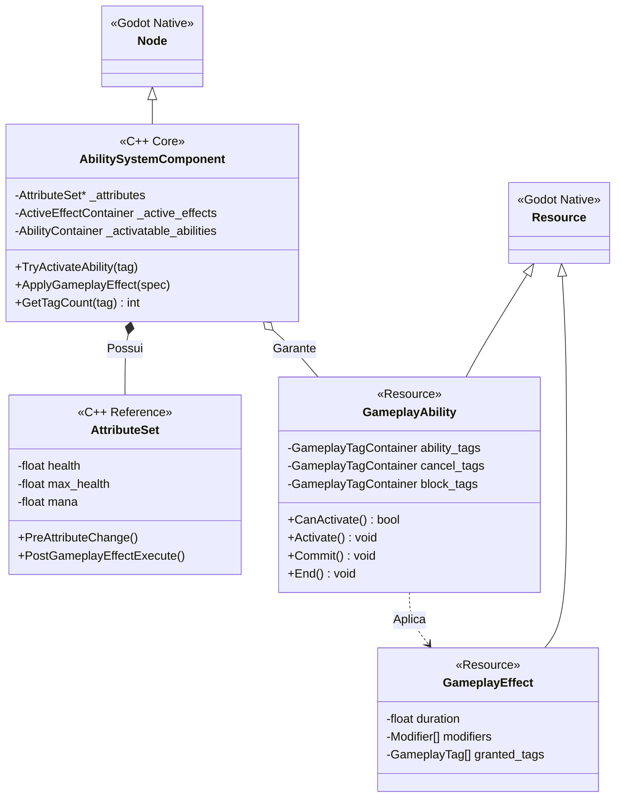

# MGAS — Arquitetura de Sistemas

> **Propósito:** Documentar as decisões de engenharia, o fluxo de dados e a divisão de responsabilidades entre C++ e GDScript no Machi Gameplay Ability System.

---

## 1. A Filosofia Híbrida: The Machi Layered Approach

O MGAS não é apenas "código C++". É uma arquitetura em camadas projetada para maximizar a performance onde importa (CPU ticks) e a flexibilidade onde é necessário (Gameplay Logic).

### 1.1. Camada 0: Foundation (C++ / GDExtension)

_O "Motor". Código compilado, estático e ultra-performático._

Aqui residem os sistemas que rodam milhares de vezes por quadro ou que exigem integridade de memória absoluta.

- **GameplayTagSystem:** Árvore de tags indexada globalmente. Comparações são bitwise ou integer comparisons O(1).
- **AttributeSet Memory:** Alocação contígua de floats para atributos (`Health`, `Mana`). Evita cache miss.
- **ActiveGameplayEffectContainer:** O "banco de dados" de buffs ativos em uma entidade. Gerencia dirty flags e recálculos.
- **Prediction Core:** Lógica de reconciliação e rollback de rede.

### 1.2. Camada 1: Bridge (Godot Objects)

_A "Ponte". Classes C++ expostas à API da Godot._

- `AbilitySystemComponent (Node)`: O cérebro que orquestra tudo.
- `GameplayAbility (Resource)`: A classe base para habilidades.
- `GameplayEffect (Resource)`: A definição de dados de um buff/ataque.

### 1.3. Camada 2: Gameplay (GDScript)

_O "Jogo". Código interpretado, dinâmico e iterável._

- `FireballAbility.gd`: Estende `GameplayAbility`. Define _o que_ acontece (vfx, som, hit).
- `HeroAttributeSet.gd`: (Opcional) Scripts auxiliares para inicialização.

---

## 2. Diagrama de Classes Principal



---

## 3. Fluxo de Execução: Ativação de Habilidade

Quando um jogador aperta o botão "Q" (Fireball), o seguinte ciclo de alta precisão ocorre:

### Passo 1: Solicitação (GDScript -> C++)

O PlayerController chama `asc.try_activate_ability_by_tag(Tags.Ability.Fireball)`.

### Passo 2: Validação (C++)

O C++ itera sobre as habilidades concedidas que casam com a Tag.
Para cada candidata, executa verificações **Bitwise** rápidas:

1. **BlockedBy:** Estou com `Status.Stun`? A habilidade tem `BlockTags: [Status.Stun]`. Se sim, falha.
2. **Cost:** Tenho Mana suficiente? (Verifica `AttributeSet`).
3. **Cooldown:** A habilidade está em cooldown? (Verifica `GameplayTags` de cooldown).

### Passo 3: Ativação e Prediction (C++ & Net)

Se validado:

- **Servidor:** Marca a habilidade como ativa. Inicia a replicação.
- **Cliente:** Se for `LocalPredicted`, inicia imediatamente sem esperar o servidor.

### Passo 4: Execução Lógica (GDScript)

O método `_activate_ability()` do script `fireball.gd` é chamado.
O Dev escreve:

```gdscript
func _activate_ability():
    play_montage("cast_fire")
    await get_tree().create_timer(0.5).timeout
    spawn_projectile()
    commit_ability() # Gasta mana e aplica cooldown
    end_ability()
```

### Passo 5: Aplicação de Efeito (C++)

Quando o projétil acerta, ele aplica um `GameplayEffect` de Dano.

1. O ASC recebe o `EffectSpec`.
2. Identifica o atributo alvo (`Health`).
3. Calcula a magnitude: `(BaseDamage * Multipliers)`.
4. Modifica o `AttributeSet`.
5. Marca o atributo como `Dirty` para replicação.

---

## 4. O Sistema de Atributos: `AttributeSet`

Diferente de Dicionários ou Resources comuns, o `AttributeSet` usa **Acessores Rápidos**.

### Estrutura em Memória

```cpp
// C++ Layout
class MachiAttributeSet : public RefCounted {
    GDCLASS(MachiAttributeSet, RefCounted);

public:
    FGameplayAttributeData Health;
    FGameplayAttributeData MaxHealth;
    FGameplayAttributeData Mana;
    // ...
};
```

Cada `FGameplayAttributeData` contém dois floats: `BaseValue` e `CurrentValue`. Isso permite recalcular atributos do zero a qualquer momento sem perder o valor original ("Stat Tetris").

### Sincronização

Em multiplayer, não enviamos pacotes gigantes. Usamos um sistema de bitmask para replicar _apenas_ o atributo que mudou (`Health`), ignorando os estáticos (`MaxMana`), economizando banda crucial.

---

## 5. Integração com Godot Nodes

O MGAS não substitui os nodes da Godot, ele os **potencializa**.

| Godot Node          | Papel no MGAS                                                                                                              |
| :------------------ | :------------------------------------------------------------------------------------------------------------------------- |
| **Timer**           | Substituído por `GetWorld()->GetTimerManager()` interno do C++ para cooldowns precisos e thread-safe.                      |
| **AnimationPlayer** | Controlado via `AbilityTasks` (ex: `PlayMontageAndWait`), garantindo sincronia entre animação e lógica de gameplay.        |
| **Signals**         | Substituídos por `Delegates/Callbacks` internos para performance, mas expostos como Signals para UI (ex: `HealthChanged`). |
| **RPCs**            | Abstraídos pelo sistema de `NetPrediction`. O dev raramente chama `@rpc` manualmente dentro de uma habilidade.             |

---

_MGAS — Arquitetura v2.0 (Deep Dive)_
