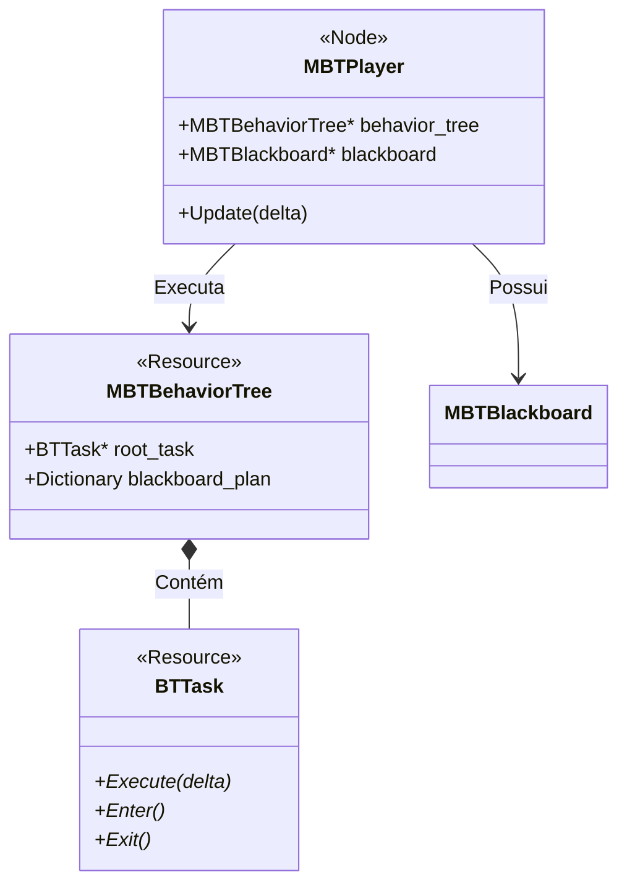

# MBT — Arquitetura C++

> **Propósito:** Explicar as classes nativas que compõem o sistema de Behavior Tree.

---

## 1. Visão Geral (UML Simplificado)

## 2. Classes Principais

### 2.1. `MBTPlayer` (Node)

O "Executor". Adicione este Node ao seu NPC para dar vida a ele.
Ele é responsável por:
1. Instanciar a `BehaviorTree` (clonagem para memória única).
2. Criar o `Blackboard` em runtime.
3. Chamar `tick()` na árvore a cada frame (process ou physics).

### 2.2. `MBTBehaviorTree` (Resource)

O "Blueprint". Um arquivo `.tres` editável no painel visual.
Ele armazena a estrutura hierárquica das Tasks (Composite, Decorator, Leaf).

### 2.3. `BTTask` (Abstract Resource)

A unidade lógica. Pode ser:
- **Composite:** `Sequence`, `Selector` (Controlam fluxo).
- **Decorator:** `Inverter`, `Repeat` (Modificam resultado).
- **Leaf:** `Wait`, `MoveTo`, `ActivateAbility` (Ação real).

Os status de retorno são:
- `SUCCESS`: Tarefa concluída.
- `FAILURE`: Tarefa falhou.
- `RUNNING`: Tarefa em andamento (chamar novamente no próximo frame).

---

## 3. O Painel "MBT"

Inspirado no LimboAI, o MBT adiciona um painel ao editor da Godot.

- **GraphView:** Visualização de nós conectados.
- **Task Palette:** Arraste e solte Tasks comuns.
- **Blackboard Editor:** Defina variáveis (`Target`, `PatrolPath`) que a árvore espera.

---

_MBT — Arquitetura V1.0_
