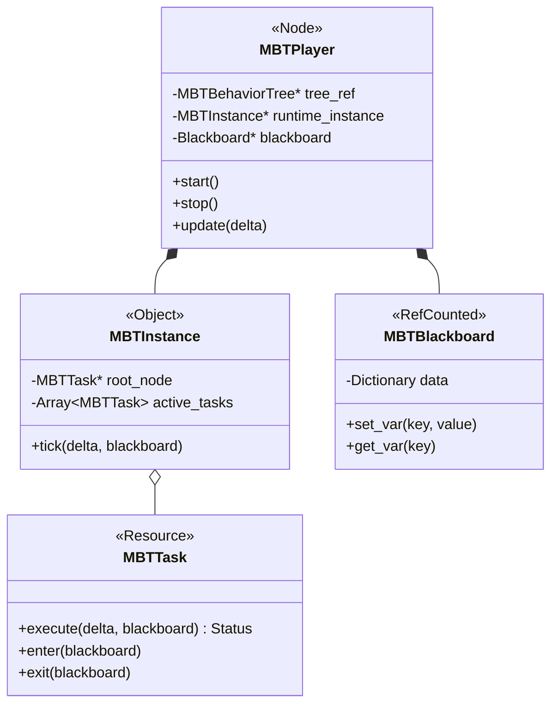

# 02. Arquitetura C++ (Under the Hood)

> **Nível:** Intermediário/Avançado
> **Foco:** Entendimento interno do plugin (GDExtension)

---

## Visão Geral do Sistema

O MBT opera como uma extensão nativa da Godot. Isso significa que seus nós herdam diretamente de classes C++ da engine (`Node`, `Resource`) e são registrados no `ClassDB`.

### Diagrama de Classes

---

## Componentes Principais

### 1. `MBTPlayer` (O Coração)
É o `Node` que você adiciona à cena.
- **Responsabilidade:** Gerenciar o ciclo de vida da IA.
- **Processamento:** No `_physics_process`, ele chama o `tick()` da instância da árvore.
- **Memória:** Ele é o dono do `Blackboard` daquela instância específica. Se você tiver 50 Orcs, terá 50 `MBTPlayers` e 50 `Blackboards`, mas todos podem compartilhar o mesmo Recurso `MachiBehaviorTree` (readonly).

### 2. `MachiBehaviorTree` (O DNA)
É um `Resource` (`.tres`). Contém a definição estática da árvore.
- Durante a edição, ele armazena a estrutura de grafos.
- No Runtime, ele serve como "molde". O `MBTPlayer` clona a estrutura necessária para execução (instancing) para garantir que o estado `RUNNING` de um Orc não interfira no outro.

### 3. `MBTTask` (A Célula)
Classe base para todos os nós.
- Métodos Virtuais expostos ao GDScript (`_execute`, `_enter`, `_exit`).
- Otimização C++: Tasks nativas (Sequence, Selector) não chamam a VM do GDScript, rodando puramente em código de máquina.

---

## O Ciclo de Tick

Quando `MBTPlayer.update(delta)` é chamado:

1.  O sistema prepara o contexto (passa o `Blackboard` e o `Actor` - dono do node).
2.  Chama-se `execute()` na Raiz.
3.  A Raiz (geralmente um Selector ou Sequence) propaga a chamada para os filhos.
4.  Se uma Task retorna `RUNNING`:
    - O ponteiro para ela é salvo.
    - No próximo frame, a execução pode "resumir" ou ser reavaliada desde a raiz (dependendo da configuração de "Memory" do nó pai).

---

## Integração com Godot

- **Serialization:** Usamos o sistema de `Properties` da Godot para salvar a árvore no disco.
- **Editor:** O painel visual manipula o `GraphEdit` da Godot, traduzindo nós visuais para a estrutura de dados `MBTTask` em tempo real.

---

_Próximo: [Manual do Editor](03_Editor_Manual.md)_
