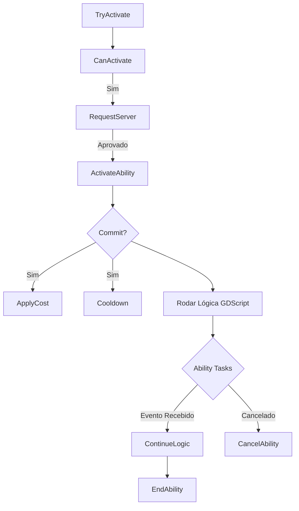

# Gameplay Abilities (GA) — O Comportamento

> **Propósito:** Detalhar a classe `GameplayAbility`, seu ciclo de vida, políticas de instanciamento e replicação.

---

## 1. O Conceito de Habilidade (GA)

No MGAS, uma **Ability** não é apenas "soltar magia". É qualquer ação que:

1. Tem um custo (Mana, Stamina).
2. Tem um tempo de execução (Cooldown, Duração).
3. Pode ser interrompida (Cancel).
4. Pode ser replicada.

Exemplos: _Pular, Atirar, Recarregar Arma, Abrir Porta, Reviver Aliado, Passiva de Regeneração._

---

## 2. Instanciamento (Instancing Policy)

Para otimizar memória, o MGAS suporta diferentes modos de execução.

### 2.1. Non-Instanced (Estático)

_Mais leve. Memória Zero._
A habilidade roda diretamente do CDO (Class Default Object) ou Resource estático.

- **Limitação:** Não pode ter variáveis de estado (`var hits_count = 0`).
- **Uso:** Habilidades instantâneas simples (Cálculo de dano puro, lógica stateless).

### 2.2. Instanced Per Execution

Uma nova cópia da GA é criada a cada vez que ela é ativada.

- **Uso:** Habilidades complexas com estado temporário (ex: um combo que precisa trackear steps).
- **Custo:** Alto (alocação de memória a cada cast).

### 2.3. Instanced Per Actor (Padrão para Herois)

Uma cópia da GA é criada quando concedida ao personagem e vive lá até ser removida.

- **Uso:** Habilidades padrão do jogador.
- **Vantagem:** Permite guardar estado persistente (ex: "Quantas vezes usei essa skill hoje?").

---

## 3. Tags de Controle

A GA usa Tags para ditar regras de combate automaticamente:

| Container                | Descrição                                                                                               |
| :----------------------- | :------------------------------------------------------------------------------------------------------ |
| `AbilityTags`            | Tags que descrevem esta habilidade (`Ability.Melee`, `Ability.Fire`).                                   |
| `CancelAbilitiesWithTag` | "Se eu ativar esta skill, cancele qualquer skill ativa que tenha X" (ex: Ultimate cancela Cast normal). |
| `BlockAbilitiesWithTag`  | "Enquanto esta skill roda, ninguém pode ativar skills com X" (ex: Enquanto giro, não posso atirar).     |
| `ActivationRequiredTags` | "Só posso ativar se eu (o dono) tiver X" (ex: Preciso de `Weapon.Equipped`).                            |
| `ActivationBlockedTags`  | "Não posso ativar se eu tiver X" (ex: `State.Stunned`).                                                 |

---

## 4. O Ciclo de Vida da Habilidade



### 4.1. Methods (GDScript API)

```gdscript
extends GameplayAbility

# 1. Validação Customizada (Opcional)
func _can_activate_ability() -> bool:
    return super() and has_enough_ammo()

# 2. A Lógica Principal
func _activate_ability():
    # Commit aplica custo e cooldown definidos no Resource
    var success = commit_ability()
    if not success:
        cancel_ability()
        return

    # Toca animação e ESPERA o evento "hit" da animação
    # play_montage_and_wait é uma AbilityTask
    var task = play_montage_and_wait("Attack_Hard")
    task.completed.connect(_on_completed)
    task.event_received.connect(_on_event)

func _on_event(event_tag, event_data):
    if event_tag == TAG_HitFrame:
        apply_gameplay_effect_to_target(...)

func _on_completed():
    end_ability()
```

---

## 5. AbilityTasks (Assincronia)

Abilities no GAS não usam `await` simples (que trava o estado ou perde referência se o node morrer incorretamente). Usam **AbilityTasks**.

São nodes C++ que gerenciam callbacks seguros:

- `WaitInputRelease`: Espera o jogador soltar o botão.
- `WaitGameplayEvent`: Espera alguém enviar um evento (`Event.Hit`).
- `WaitDelay`: Timer sincronizado com o servidor.
- `MoveToLocation`: Move o CharacterBody até o alvo.

Se a Habilidade for cancelada (`CancelAbility`), todas as Tasks ativas são mortas limpas automaticamente.

---

_MGAS — Gameplay Abilities v2.0_
